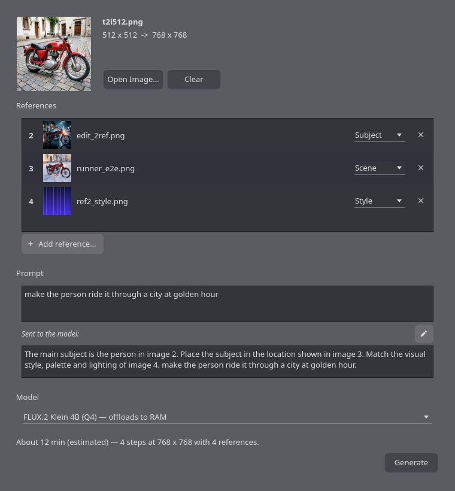

# local-edit

Edit images with a prompt and reference pictures, entirely on your own machine.

Open a photo, add a few reference images and say what should change — *"make the
person ride a motorcycle"*, *"make this scenery rainy"*, *"put them in the jacket
from image 2, on the street from image 3"*. Nothing leaves the computer, and
there is no API key.

A sibling to [local-upscaler](https://github.com/Merligus/local-upscaler): same
PySide6 interface, same three-screen flow, same "download what you need, verify
it, and be honest about how long it will take".



---

## What it does

**References have roles.** Each reference image gets a role — Face, Clothing,
Scene, Style, Object — and the app writes the sentence that wires it up:

```
References
  1  photo.jpg     (the image being edited)
  2  face.jpg      Face
  3  jacket.png    Clothing
  4  paris.jpg     Scene

Prompt:  make them ride a motorcycle

Sent to the model:
  Keep the face and identity of the person in image 2. Dress the subject in
  the clothing from image 3. Place the subject in the location shown in
  image 4. make them ride a motorcycle.                            [Edit]
```

The composed prompt is always visible and always editable. Drag the rows to
reorder them and the numbering — and the prompt — follows, because that is what
the model's `--increase-ref-index` actually does.

**The model list tells you what your machine can do.** The catalog runs from
3.5 GB to 34 GB, and every entry is graded against the GPU you actually have:

```
ID                        SIZE STATE          ON THIS MACHINE                EST @768
flux2-klein-4b-q4         5.3G ready          offloads to RAM                6 min
flux2-klein-4b-q8         8.9G 8.6 GB to get  streams from disk              17 min
kontext-q3                8.1G 8.1 GB to get  streams from disk              4.3 h
flux2-klein-9b-q4        11.0G 10.6 GB to get streams from disk              34 min
qwen-edit-2509-q2        13.4G 13.4 GB to get streams from disk              9.8 h
flux2-dev-q4             34.5G 34.1 GB to get needs 34 GB free, 29 GB left   6.6 h
```

Models too big for the current machine are **shown, not hidden**, with what they
would need. Only a disk shortage actually stops you: everything else will try,
because finding out where your hardware gives up is a legitimate thing to want.

**The estimate is measured, not guessed.** After the first run of each model at
each size the real rate is stored and used from then on.

---

## Requirements

Arch / CachyOS:

```fish
sudo pacman -S --needed pyside6 python-pillow vulkan-icd-loader
```

That is the whole dependency list. There is no `pip install`, no virtualenv
and no PyTorch — as a size and packaging choice, **not** because PyTorch
cannot run here. It can: `torch 2.14.0+cu126` installs on Python 3.14 and
reaches 1.89 of this card's 2.1 TFLOPS. docs/COMPATIBILITY.md shows the
measurement and the trade-offs, including the two things I had wrong about it.

The image engine is [stable-diffusion.cpp](https://github.com/leejet/stable-diffusion.cpp),
a pair of standalone binaries the app fetches for you:

```fish
python3 -m local_edit --fetch-engine     # 46 MB, Vulkan
python3 -m local_edit --devices          # check it found your GPU
```

Then a model. The default is 5.3 GB:

```fish
python3 -m local_edit --fetch-models flux2-klein-4b-q4
```

---

## Running it

```fish
bin/local-edit                  # the launcher
bin/local-edit photo.jpg        # with an image already loaded
python3 -m local_edit           # equivalent, from the project directory
python3 -m local_edit --install # add it to the application menu
```

| Command | What it does |
|---|---|
| `--list-models` | the catalog, graded against this machine |
| `--fetch-engine [vulkan\|cpu\|rocm]` | download and verify the engine |
| `--fetch-models ID… \| all` | download a model |
| `--bench [ID…]` | time a real run and record the rate |
| `--devices` | what the engine can compute on |
| `--refresh-sizes` | re-read every weight file's size from HuggingFace |
| `--install` / `--uninstall` | desktop entry and icons |

---

## The models

| id | What it is for | Refs | Steps | Download |
|---|---|---|---|---|
| **`flux2-klein-4b-q4`** | **the default.** Four steps, fits a 4 GB card | 6 | 4 | 5.3 GB |
| `flux2-klein-4b-q8` | the same model, barely any quantisation loss | 6 | 4 | 8.9 GB |
| `kontext-q3` | the best instruction editor at this size | 3 | 24 | 8.1 GB |
| `flux2-klein-9b-q4` | Klein's bigger sibling, much better adherence | 6 | 4 | 11.0 GB |
| `qwen-edit-2509-q2` | built for person + product + scene composition | 3 | 20 | 13.4 GB |
| `flux2-dev-q4` | the ceiling, behind a 24 B language model | 6 | 28 | 34.5 GB |

Everything downloads on demand into `~/.local/share/local-edit/models/`, which
is configurable — one of these does not fit on a small root partition.

**Faces** come from giving an edit model a reference tagged **Face**, not from
a dedicated identity model. There is no IP-Adapter or PhotoMaker tier: this
engine build cannot load either, which is an upstream regression rather than a
design choice, and docs/TODO.md has the diagnosis and the workaround. In
practice FLUX.2 Klein and Kontext both hold a face from one reference
reasonably well, and Qwen-Image-Edit was trained specifically for it.

**What has actually been run.** `flux2-klein-4b-q4` has been run end to end on
the development machine, through both execution paths. The rest are wired to
the file combinations upstream's own documentation specifies, and their
command lines and request bodies are unit-tested, but the weights have not
been downloaded and run — that is 76 GB and several days of this GPU's time.

That distinction is not pedantic, and it has already cost two tiers. An SD 1.5
+ IP-Adapter entry and an SDXL + PhotoMaker entry were both written,
downloaded and removed: this engine build cannot load anything carrying a CLIP
vision tower, and PhotoMaker proves it is a regression by loading fine on a
build from January. Nothing offline caught either one — the command lines were
right, the files were the ones upstream names, the byte counts matched, and
the tests were green. Only running them did. Treat an untried tier as likely-
but-not-certain; `--fetch-models` followed by one generation is how you find
out.

---

## Measured on the development machine

A **GTX 1050 Ti** — Pascal, 4 GB, no fp16 under Vulkan — with 12 GB of RAM.
FLUX.2 Klein 4B (Q4), `--offload-to-cpu`:

| | 512 × 512 | 1024 × 1024 |
|---|---|---|
| sampling | **22.3 s/step** | **76.0 s/step** |
| peak VRAM beyond weights | 0.49 GB | 2.76 GB |
| outcome | fine | **out of device memory at segment 15/27** |

Whole runs at 512 × 512, measured end to end:

| | |
|---|---|
| generate from a prompt alone | **2 min 22 s** — 11 s loading weights, 19 s encoding the prompt, 101 s sampling, 10 s decoding |
| edit an image, one reference | **2 min 58 s** on a warm engine |
| edit an image, two references | **4 min 22 s** |

The engine stays loaded between edits, so only the first run of a session pays
the load; a second edit on a warm engine measured 178 s against 182 s for the
first.

Two things that fall out of those numbers and are worth knowing:

* **References are not free.** They are concatenated onto the sequence the
  transformer attends over, so they are more image to process — 22.3 s/step with
  none against 55.4 s/step with two. The estimate accounts for this.
* **Time scales *sub*-linearly with pixels and memory *super*-linearly.** Four
  times the pixels cost 3.4 times the time (a small GPU is not busy at 512²) but
  5.6 times the VRAM (attention is quadratic in tokens). That combination is why
  1024 × 1024 is out of reach on this card while 768 × 768 is comfortable.

---

## How it is put together

```
local_edit/
  engine/          Qt-free, importable with no display
    catalog.py     the recipes: which files, how to sample, what they cost
    hardware.py    probes VRAM/RAM/disk, grades each recipe against them
    binary.py      finds sd-cli/sd-server, builds their command lines
    server.py      owns one warm sd-server, taps its output for progress
    client.py      the /sdcpp/v1 job API over urllib
    progress.py    parses the engine's console output into a progress bar
    prompt.py      role slots -> the sentence sent to the model
    fetch.py       verified, resumable downloads
    runner.py      one edit, start to finish
  ui/              PySide6, three pages in a QStackedWidget
```

Two decisions carry most of the design:

**A warm server, not a process per edit.** Weights here are 5 to 34 GB and take
tens of seconds to load, and editing a prompt is inherently iterative. So one
`sd-server` child process holds the weights across edits and is retired on an
idle timer, because it is also holding most of a 4 GB card.

**Progress comes from the engine's output, not its API.** The job API reports
`queued` / `generating` / `completed` and nothing between, which is not an
interface for a run that takes minutes. Since the app owns the process it can
read what the process prints — the same manoeuvre local-upscaler makes, and for
the same reason.

---

## Tests

Standalone scripts. No framework, so they run wherever the app does.

```fish
for t in tests/test_*.py; python3 $t; end
```

`tests/test_catalog_remote.py` is the only one that needs the network, and it
earns the wait: `fetch` refuses any file that arrives at the wrong length, so a
byte count that is wrong in the catalog makes that model permanently
un-downloadable and no offline test can tell.

---

## Licence

MIT for the application code (see `LICENSE`). The models are **not** covered by
it, are not redistributed here, and carry their own terms — `--list-models`
prints each one's licence, and two of them are non-commercial.
